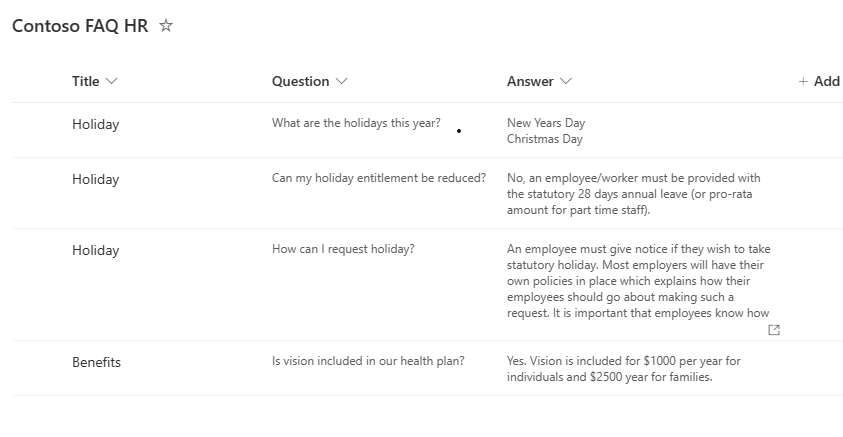
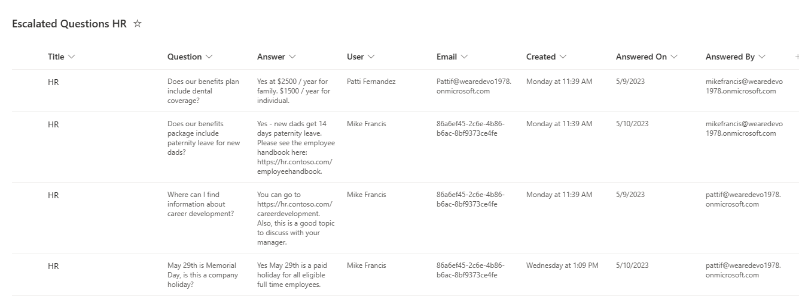
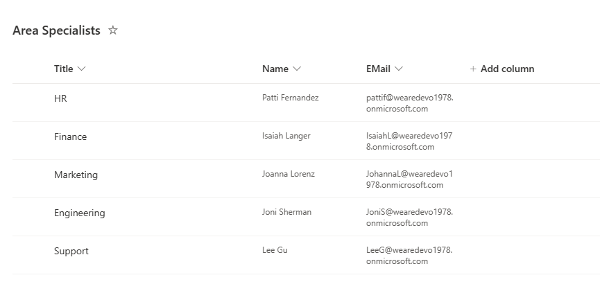
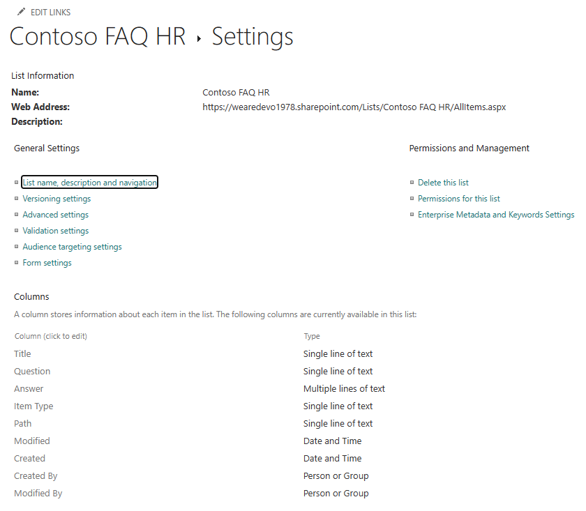
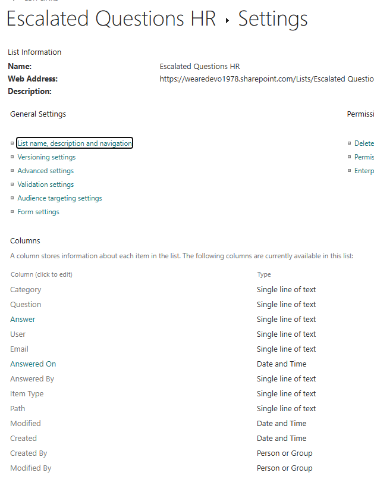
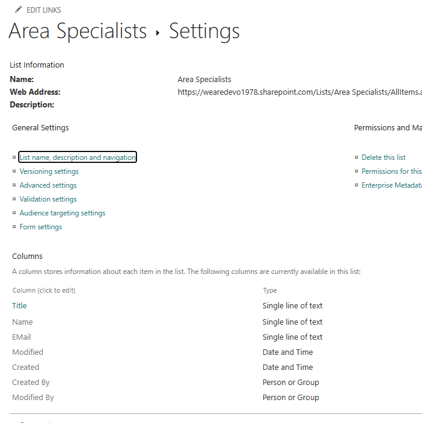
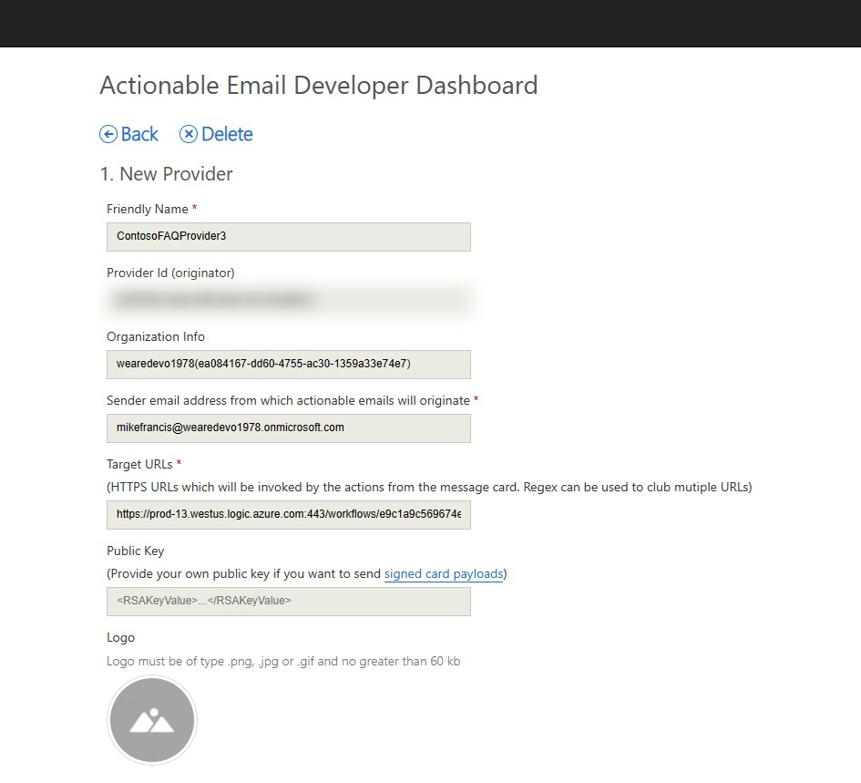

## Sharepoint Lists
This solution references three types of tables. You will need a FAQ list and and Escalation list for each 'department'. See List Types below.

### List Types
1. **FAQ List** - This is the main list that question an answer pairs are pulled from. Each department will have it's own list. For example the company 'Contoso' may have an **HR** and **Marketing** department FAQ lists. Naming convention: ```[[Company Name]] FAQ [[Department Name]]```. For Contoso HR, the list name would be: **Contoso FAQ HR**.

Note: The *Title* column in the FAQ table stores the subcategory for each department's questions. In the screen shot below, there are two subcategories, **'Holiday'** and **'Benefits'**.



2. **Escalation Questions List** - This list is where the questions and answers of escalated questions are stored. Like the FAQ list, each department will have its own escalation list. Naming convention: ```Escalated Questions [[Department Name]]```. For HR, the list name would be: **Escalated Questions HR**



3. **Area Specialists List** -  This list contains the leads for each department. If a question has not been answered by the team within 48 hours, the lead will be emailed a request to answer it. The name of this list is '**Area Specialists**'.




### List Schemas

1. **FAQ List Schema** 



2. **Escalation Questions List Schema** 


3. **Area Specialists List Schema**


## Import into environment

### Importing for testing

1. Download the Solution zip file from here: https://github.com/mjfusa/pva-faq-sharepoint/blob/master/solution/PVA-FAQ-SharePoint.zip

2. Import - Bring the solution into Teams. When importing you'll be prompted to setup a connection to SharePoint and other Microsoft 365 connectors used by the flows.
See documentation here:  [Import the solution with your bot](https://learn.microsoft.com/en-us/power-virtual-agents/authoring-export-import-bots#import-the-solution-with-your-bot)

3. Publish and Share - Make the Power Virtual Agent available.
Share - Invite users to use the PVA.
See documentation here: https://learn.microsoft.com/en-us/power-virtual-agents/publication-add-bot-to-microsoft-teams. Also see 'Show to everyone my org' for Deployment via admin for production release.


## Setup Actionable Messages.

An Actionable message facilitates a secure HTTP request from an email to a Power Automate flow. You will need to:

1. Edit the flow 'ProcessAnswerReponseFromEmail' and copy the Url from the first step 'When a HTTP request is received'. You will need this in the next step.
1. Actionable Message Registration tool: https://aka.ms/publishoam. Create a Actionable message registration saving the ```Provider id``` for the next step. You can have the tool setup a testing registration during the initial testing phase. Include the URL saved from step one in the field 'Target URLs'.


 
3. Update the flow 'NotificationFlow', step 'Compose Email' updating the *originator id* value. This the line that needs to be updated: ```  "originator": "a697f6e8-3d8b-4f96-96e4-edc76aaf9b31"```. The GUID should be updated to the value you received from the registration tool. 

Note that it can take up to four hours before the registration is working. 

More information on Actionable Messages
https://learn.microsoft.com/en-us/outlook/actionable-messages/send-via-email

Actionable Messages Debugger
https://appsource.microsoft.com/en-us/product/office/wa104381686?exp=ubp8

